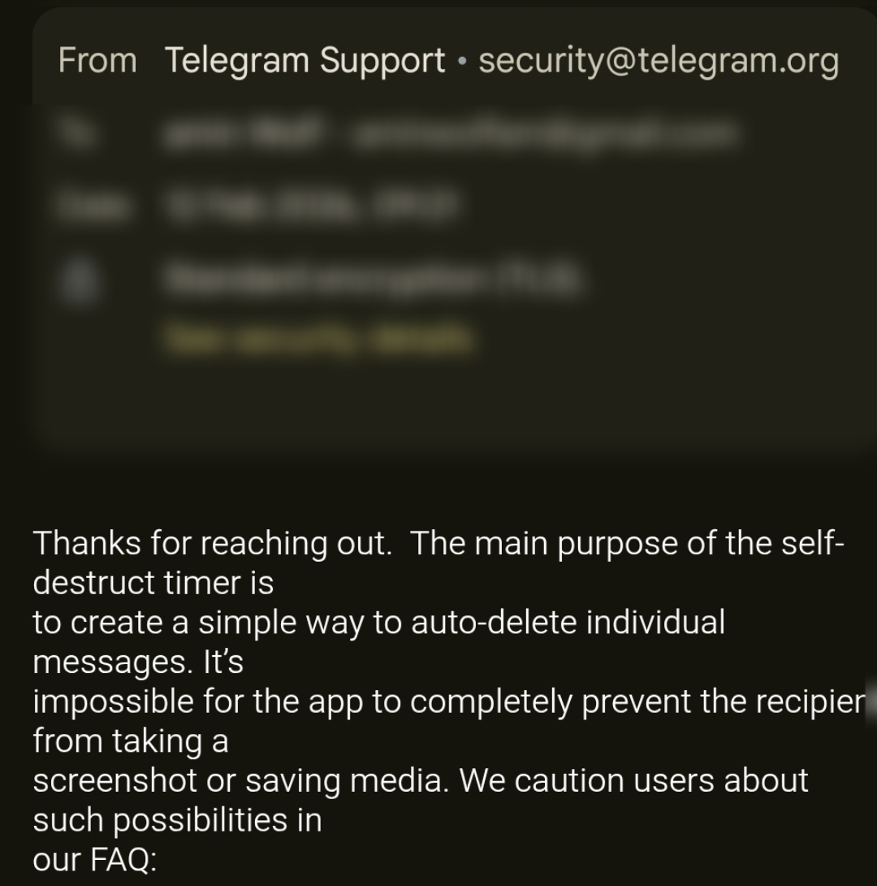

# telegram-view-once-analysis
Telegram View Once Media Is Not Truly Ephemeral
# Telegram View Once Media Retrieval – Technical Security Research

## Overview

This repository documents a technical analysis of Telegram's View Once (self-destructing media) feature and its behavior at the protocol level (MTProto).

The View Once feature is designed to allow users to send photos and media that can only be viewed a single time before they are automatically removed.

However, during controlled testing, it was observed that View Once media can still be retrieved and saved before being opened in the official Telegram client by using MTProto-based API clients.

This research focuses on documenting the real-world behavior of the system and analyzing the gap between user expectations and the underlying technical implementation.

---

## Key Observation

The main observation is:

> View Once media is not strictly enforced at the server or protocol level, but primarily at the official client (UI) level.

This means that if a valid authenticated session exists, media may still be accessible through the Telegram API before it is opened in the official application.

---

## Test Environment

- Python 3.x
- Telethon (MTProto client library)
- Telegram MTProto API
- Official Telegram account (test-controlled)
- API_ID and API_HASH obtained from Telegram developer platform
- Linux / Windows testing environment

---

## Reproduction Steps

1. Send a View Once photo to a controlled test account.
2. Do not open the media in the official Telegram client.
3. Establish an MTProto session using Telethon.
4. Listen for incoming messages in real-time.
5. Detect media message object.
6. Download media directly using `download_media()` method.
7. Save and verify file integrity locally.

---

## Technical Implementation Notes

This research uses Telethon, a third-party Python library that implements the Telegram MTProto protocol.

Telethon allows direct communication with Telegram servers using authorized user sessions.

Important clarification:

- No UI interaction is involved
- No screenshots or screen recording is used
- No memory scraping or filesystem extraction is performed
- Media is retrieved directly through authorized API access

---

## Code Example (PoC)

```python
from telethon import TelegramClient, events

client = TelegramClient("session", API_ID, API_HASH)

@client.on(events.NewMessage)
async def handler(event):
    if event.message.media:
        file_path = await event.message.download_media()
        print("Saved:", file_path)

client.start()
client.run_until_disconnected()
